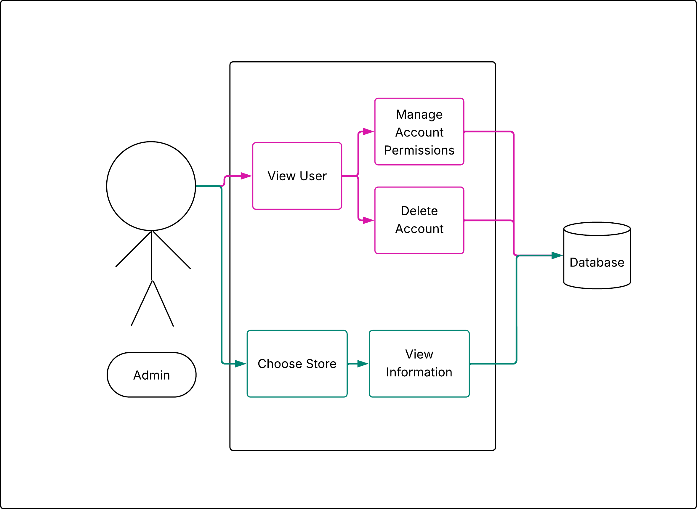
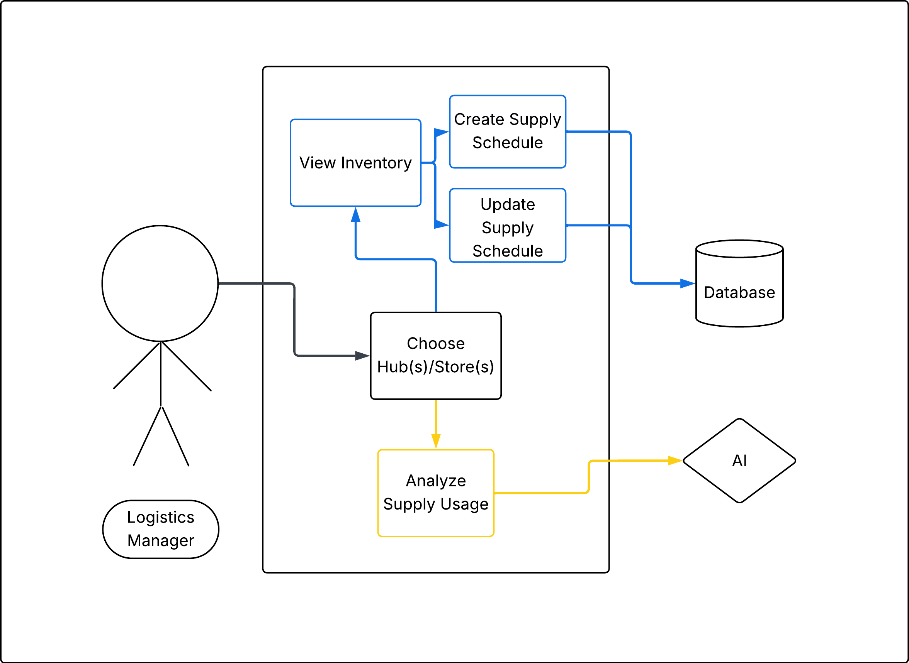
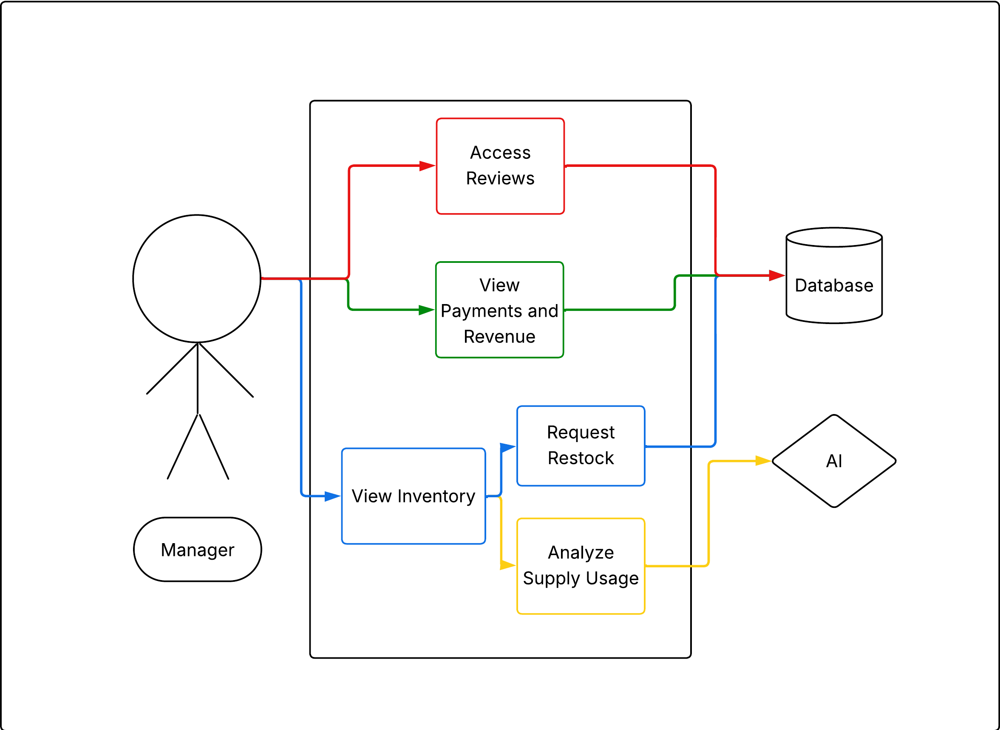
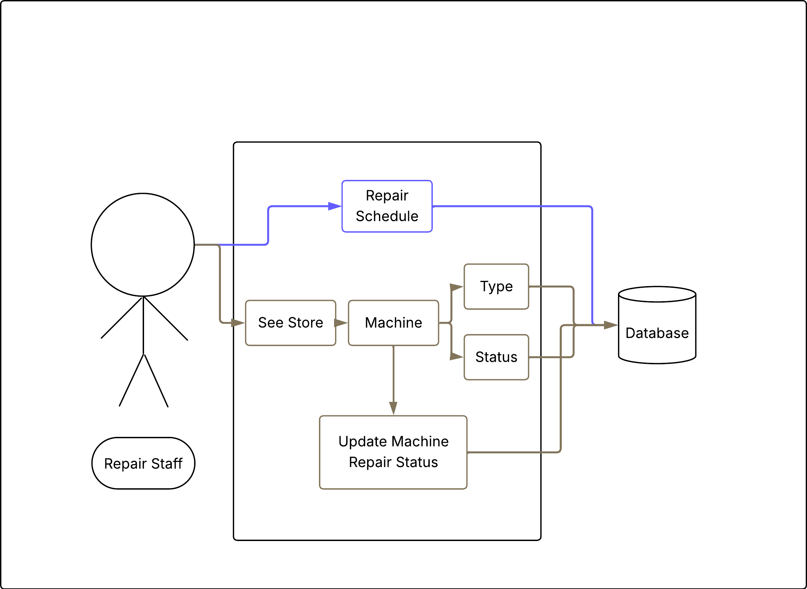
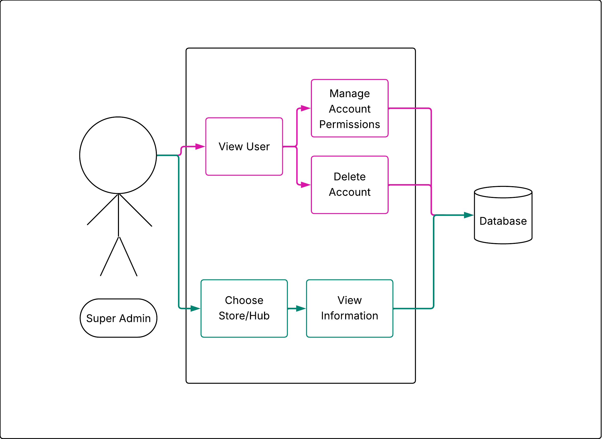
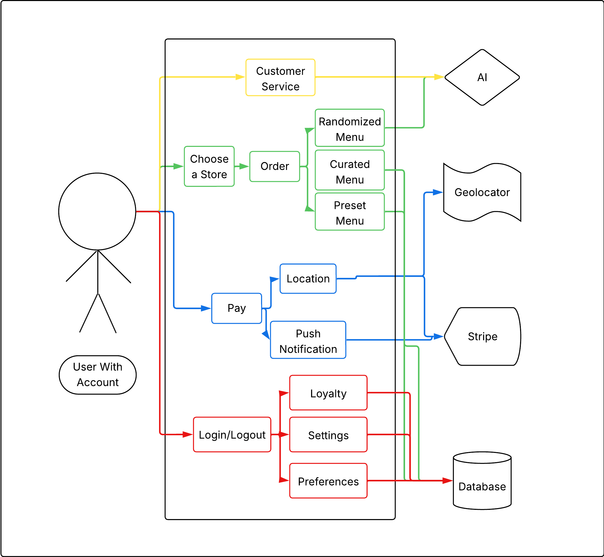
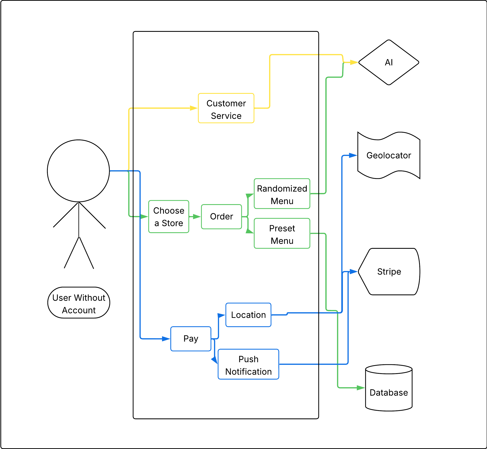

# CodePop Requirements Document

## 1. Introduction

**1.1 Overview of CodePop**
CodePop is an innovative beverage application that leverages AI, automation, and distributed systems to redefine soda customization and ordering. The platform supports mobile and desktop usage and is designed for minimal human intervention, relying on AI-driven inventory management, ordering, logistics coordination, and maintenance tracking.

**1.2 Purpose of This Document**
This document defines the complete functional, non-functional, business, and system requirements for CodePop. It aligns developers, stakeholders, and system architects on scope, priorities, and responsibilities, including newly introduced multi-store, logistics, and maintenance capabilities.

**1.3 MoSCoW Analysis**
Requirements are categorized as:

- **M** – Must Have  
- **S** – Should Have  
- **C** – Could Have  
- **W** – Won’t Have  

---

## 2. Functional Requirements

### 2.1 System Scope Expansion

**2.1.1 Multi-Store, Nationwide Support (M)**

The CodePop platform must support deployment across multiple stores distributed throughout the United States. Each store operates as an independent unit while still participating in regional coordination for supply, logistics, and data synchronization. Stores must be able to function autonomously in day-to-day operations, even if other stores or regional systems are unavailable.

The system must allow for:
- Independent store configuration (inventory, machines, staff roles)
- Regional grouping of stores for supply and logistics coordination
- Expansion to new stores without requiring downtime or reconfiguration of existing locations
- Store-specific operational parameters and customization

**2.1.2 Decentralized Architecture (M)**

The system must operate using a decentralized architecture. There is no single central server that controls all stores nationwide. Instead:
- Each store maintains its own local operational data
- Stores communicate directly with other stores in the same region as needed
- Stores communicate directly with regional supply hubs
- Regional data synchronization must tolerate intermittent or unstable connectivity

In the event of connectivity loss:
- Local store operations (ordering, inventory tracking, machine operation) must continue uninterrupted
- Synchronization of data (inventory usage, maintenance logs, demand metrics) must resume automatically once connectivity is restored
- Conflicts during synchronization must be resolved using timestamp-based or priority-based reconciliation rules

### 2.2 Supply & Logistics System

**2.2.1 Supply Hubs (M)**

The system must support seven (7) regional supply hubs, each assigned to a specific geographic region:

- **Region A:** Chicago, IL
- **Region B:** New Jersey / New York
- **Region C:** Logan, UT
- **Region D:** Dallas, TX
- **Region E:** Atlanta, GA
- **Region F:** Phoenix, AZ
- **Region G:** Boise, ID

Each supply hub is responsible for managing and distributing ingredients, machine parts, and other consumables required for store operations.

Supply hubs must be capable of delivering to:
- Stores located within their assigned region
- Stores located in other regions, provided the destination store is within a 1000-mile delivery radius

The system must allow hubs to manage:
- Current stock levels
- Outgoing and incoming shipments
- Estimated delivery times
- Cross-region fulfillment when a closer hub lacks sufficient inventory

**2.2.2 Supply Coordination (M)**

Managers and logistics administrators must be able to coordinate supplies through multiple channels:
- Local store inventory tracking
- Shared local suppliers (e.g., regional syrup or CO₂ vendors)
- At least one assigned regional supply hub

The platform must provide a unified interface for viewing:
- Current store inventory
- In-transit shipments
- Hub availability and fulfillment capacity
- Supplier lead times

AI-assisted demand prediction must be used to forecast future supply needs. This prediction system must:
- Use historical usage data from individual stores and regions
- Support CSV-based data ingestion for historical records and external forecasting inputs
- Continuously update forecasts based on real-time usage trends

The system must generate actionable recommendations, such as:
- Suggested reorder quantities
- Optimal sourcing location (local supplier vs. supply hub)
- Recommended reorder timing to prevent shortages

### 2.3 Machine Maintenance Tracking

**2.3.1 Maintenance System Overview (M)**

Each store must track all operational machines used in drink preparation and fulfillment. For every machine, the system must store:
- Machine type and model
- Operational start date
- Current maintenance status
- Complete maintenance and repair history

This information must be available to:
- Store managers
- Regional maintenance coordinators
- Authorized logistics or technical administrators

**2.3.2 Maintenance Status Types (M)**

The system must support the following machine states:

- **normal:** Machine is operating within expected parameters
- **warning:** Machine is operational but exhibiting early indicators of potential failure
- **repair-start:** Machine has entered an active repair state
- **repair-end:** Repair has been completed and machine is ready for operation
- **error:** Machine has encountered a fault requiring attention
- **out-of-order:** Machine is not operational and cannot be used
- **schedule-service:** Machine is due for routine or preventive maintenance

Transitions between states must be logged automatically with timestamps and responsible personnel (when applicable).

**2.3.3 Repair Optimization (S)**

The system should optimize repair and maintenance schedules using AI-assisted planning. Optimization objectives include:
- Minimizing total technician travel time across stores
- Respecting maximum allowable time between service visits for each machine type
- Preventing machines in a **warning** state from exceeding safe operational thresholds

The optimization system should consider:
- Geographic location of stores
- Technician availability
- Severity and priority of machine issues
- Historical failure patterns

### 2.4 Test Data Requirements

**2.4.1 Supply Hubs (M)**

Create 7 supply hubs, one per region (A–G).

**2.4.2 Stores (M)**

- Region C: 20 stores
- Neighboring regions (within 200 miles): minimum 5 stores per region

**2.4.3 Roles & Supplies (M)**

Assign:
- One logistics_manager per hub (Regions A–G)
- One repair_staff for Region C

Populate:
- Supply inventories
- Maintenance schedules
- Machine status histories

---

## 3. Non-Functional Requirements

**Decentralized (M)**

There is no central server to manage stores; each store must communicate directly with other stores within their region.

**Data Consistency (M)**

With no central server, we must define how stores agree on the state of supplies.

**Fault Tolerance (S)**

Each store must be able to operate autonomously if its connection to other stores or hubs is severed. Local maintenance tracking and sales must be cached locally and synchronized once the connection is restored.

**Auditability & Logging (S)**

The system must maintain an immutable transaction log at each node. Every action taken by a `logistics_manager` or `repair_staff` must be timestamped and cryptographically signed to prevent tampering.

**Responsive (M)**

The application must be responsive, providing an optimal user experience across a variety of devices, including desktops, tablets, and mobile devices, with seamless adaptation to different screen sizes and orientations.

**Error Messages (M)**

The application must provide clear, informative error messages for user interactions, invalid inputs, and system errors. Error messages should be concise, easy to understand, and where applicable, include suggestions for resolution.

**Scalability (M)**

The application must be designed to scale efficiently, handling an increasing number of user transactions and data volume without performance degradation, ensuring a consistent user experience. It must not be limited to one store; it must be able to support many stores across the USA.

**Service Discovery (M)**

When a new store opens in a region, the application must include a Service Discovery mechanism. New store nodes must be able to broadcast their presence and "handshake" with existing regional peers automatically upon deployment.

**Cross-Browser Capability (S)**

The application must be compatible with the latest versions of major browsers, including Chrome, Firefox, Safari, and Edge, ensuring consistent functionality and user experience across all platforms.

**Security (M)**

All sensitive data, including user credentials, payment information, and location data, must be encrypted using industry-standard encryption protocols, such as TLS (Transport Layer Security). Additionally, the application should adhere to best practices for secure coding and data handling to ensure the protection of all user information. All inter-store communications must be digitally signed. Every node must verify the sender's identity using a Public Key Infrastructure (PKI) before processing supply or maintenance updates.

**Accessibility (S)**

The application must comply with Web Content Accessibility Guidelines (WCAG) 2.1 to ensure that users with disabilities can navigate and use the application effectively. This includes avoiding problematic color combinations, such as red and green, and providing alternative text labels for color-based indicators.

**Reporting (S)**

The system should include features for inventory management. It must automatically notify the manager when items are out of stock and generate detailed reports. Additionally, the system should provide the manager with financial reports, offering insights into revenue. This will ensure timely restocking, help in identifying inventory trends or potential issues, and provide a clear understanding of the store's financial performance.

---

## 4. Business Requirements

### 4.1 Operational Philosophy & Store Model

**Minimal Human Intervention (M)**

The CodePop business model prioritizes automation to reduce operational costs and increase efficiency:
- Stores operate primarily through robotic drink preparation with no on-site staff required at most locations.
- A single manager must be able to effectively oversee multiple store locations remotely.
- AI systems handle inventory management, order processing, supply coordination, and customer support to minimize manual intervention.

---

### 4.2 Revenue & Payment Systems

**Payment Processing (M)**

The application must support complete financial transaction capabilities:
- Process payments securely at the time an order is placed through the app or website.
- Support refund processing when orders are canceled before drink arrives.
- Track revenue independently for each store location to enable financial reporting and performance analysis.

**Revenue Tracking & Reporting (M)**

Each store location must have comprehensive revenue visibility:
- Real-time revenue tracking accessible to managers and administrators.
- Historical revenue data for trend analysis and business planning.
- Per-location financial performance metrics for multi-store comparison.

**Saved Payment Methods (C)**

To streamline repeat purchases and improve customer experience:
- Users may optionally save credit/debit card information for future transactions.
- Saved payment data must be encrypted and stored according to PCI-DSS compliance standards.

---

### 4.3 Supply Chain & Logistics Management

**Inventory Tracking System (M)**

A comprehensive system to monitor and manage ingredient levels at each location:
- Remote visibility into flavor syrup, soda base, cream, and add-in levels at all store locations.
- Automated warnings when ingredient levels fall below configurable thresholds.
- Manager notifications with recommended order quantities based on current usage rates.
- AI analytics that learn usage patterns per location and provide estimated supply requirements for monthly ordering cycles.

**Order Pickup Tracking (S)**

To prevent cooler capacity issues and maintain drink quality:
- Track elapsed time for each completed order waiting in pickup coolers.
- Automated alerts when orders exceed configurable wait time thresholds.
- Systematic disposal of stale orders to maintain cooler availability for new orders.

---

### 4.4 Customer Engagement & Loyalty

**AI Customer Support (S)**

To reduce customer service costs while maintaining satisfaction:
- AI-powered chatbot to guide customers through common issues and questions.
- Automated complaint intake and initial triage to reduce human intervention.
- Continuous learning from customer interactions to improve response quality.

**Member Loyalty Program (C)**

To encourage repeat business and increase customer lifetime value:
- Points accumulation system tied to purchase amounts.
- Redeemable rewards for free items or discounts once point thresholds are reached.
- Loyalty status visible within user accounts.

**Social Media Integration (C)**

To generate organic marketing and brand awareness:
- In-app sharing functionality to post favorite drinks to social platforms (X, Instagram, Facebook).
- User-generated content to promote CodePop through personal networks.

---

### 4.5 Business Requirements MoSCoW Summary

**Must Have (M):**
- Minimal human intervention operational model with robotic drink preparation
- Complete payment processing with refund capabilities
- Per-location revenue tracking and reporting
- Comprehensive inventory tracking with low-stock warnings

**Should Have (S):**
- Order pickup tracking with automated stale order disposal
- Repair schedule optimization for travel efficiency and preventive maintenance compliance
- AI customer support chatbot for issue resolution

**Could Have (C):**
- Saved payment methods for streamlined checkout
- Member loyalty program with points and rewards
- Social media sharing integration for organic marketing

**Won't Have (W):**
- Global trend-based inventory forecasting (unreliable external data)
- Shared user accounts across multiple individuals
- Stored-value wallets or gift card systems
- Cash payment processing at locations

## 5. User Requirements

### 5.1 User Account Management

**Account Creation (M)**

Users must be able to create an account or log in to the application using a combination of a username, password, and email address. This process includes setting up security measures such as email verification and password strength checks to protect user accounts from unauthorized access.

**Profile Management (M)**

Users should be able to view and edit their profile information after initial sign-up. The profile management system should ensure that updates are reflected in real-time and maintain consistency across all parts of the application, including personalized recommendations and saved preferences.

**Multi-Store Syncing (M)**

Users should be able to access their information from any store. The software should suggest which location to buy from based on saved preferences and current location.

---

### 5.2 Drink Customization & Ordering

**Favorite Drinks (M)**

Users should be able to mark and view their favorite drinks. The application should provide an intuitive interface for users to manage their favorites, and ensure that this list is easily accessible for quick reordering and personalized recommendations.

**Edit Preferences (M)**

Users should be able to customize their drink preferences, including saving their preferred location and getting suggested new drinks based on existing user preferences and previous orders. Users should also be able to dislike ingredients so they aren't recommended.

**First-time user tutorial:** *(S)* 
New users should be guided through a tutorial when they first use the application. The tutorial should not only introduce the basic functionalities but also highlight unique features of the app, ensuring a smooth onboarding experience and helping users get the most out of the application from the start. 

**Choose time for drink to be ready:** *(S)* 
Users should be able to select a specific time for their drink to be ready. This feature aims to provide convenience for those users who do not want to use geolocation functionality by allowing them to plan ahead and ensure their drink is prepared and available precisely when they want it, reducing wait times and improving overall satisfaction.

**Rate drinks:** *(S)* 
Users should be able to rate the drinks they purchase. The rating system should enable users to provide detailed feedback on their experience, which will be used to enhance the quality of the drinks and inform other customers about popular choices and potential improvements.

**Chat functionality with AI support staff:** *(C)* 
Users should be able to chat with an AI-powered support staff for assistance. The AI support staff should be capable of handling a wide range of queries and issues, providing instant help and guidance while learning from reactions to improve its responses over time.

---

### 5.3 Support & Engagement

**Chat Functionality with AI Support Staff (C)**

Users should be able to chat with an AI-powered support staff for assistance. The AI support staff should be capable of handling a wide range of queries and issues, providing instant help and guidance while learning from reactions to improve its responses over time.

**Loyalty Program (C)**

A loyalty program should be available to reward repeat customers. This program should offer various incentives such as points, discounts, or exclusive offers, fostering customer retention and encouraging continued patronage by recognizing and rewarding frequent visits.

**Social Media Functionality (C)**

The application should integrate with social media platforms to enhance user engagement and sharing. Users should be able to seamlessly share their experiences and favorite drinks, as well as interact with the soda shop's social media presence, creating a sense of community and boosting brand visibility.

---

## 6. User Roles & Permissions

### 6.1 New Roles

**logistics_manager**
- Manage supply distribution within a region
- Coordinate deliveries between hubs and stores
- Analyze supply usage via AI using CSV imports

**repair_staff**
- Manage repair schedules for machines they are in charge of at store locations they manage
- Import repair schedules from CSV file containing:
  - store location: address field
  - machine type: enumerated code of machine types
  - machine status: one of:
    - `normal`: machine operating normally
    - `repair-start`: servicing started; machine is off-line
    - `repair-end`: servicing finished
    - `warning`: non-critical issue; operational but needs repair soon
    - `error`: critical issue; requires repair within a week
    - `out-of-order`: not operational
    - `schedule-service`: operational but needs scheduled maintenance within one month
  - status date: date when the status was recorded
- Optimize repair schedule to minimize travel time, with constraints including:
  - maximum time allowed between service visits
  - maximum time a machine with a warning can remain operational before shutting down without service

**super_admin**
- Can access data for any store locations
- Can view any page that anyone else has access to

---

### 6.2 Updated Existing Roles

**admin**
- Can access their own store information only
- Has access to manage user account data
- Has ability to update/remove/unlock user accounts
- Has the ability to add manager accounts/grant permissions

**manager**
- Can access their own store information only
- Has access to data such as stock inventory
- Has access to user payments
- Has access to revenue reports

**account_user**
- Can access their own information from any store
- Software will suggest which location to buy from based on:
  - the user's current location and preferred pickup time, or
  - the user's preferred location
- Software remembers previous orders and suggests new drinks based on preferences

**general_user**
- User can use the app to order drinks on a single time basis without creating an account
- This user's data and preferences aren't saved in the system

---

## 7. Use Case Stories

**Logistics Manager**
- *(M)* As a Logistics Manager, I want to view real-time inventory levels across all stores in my assigned region so that I can make informed supply distribution decisions.
- *(M)* As a Logistics Manager, I want to assign deliveries from my regional supply hub to stores within and outside my region (up to 1000 miles) so that supply shortages are prevented.
- *(M)* As a Logistics Manager, I want to coordinate supply transfers between local stores and shared regional suppliers so that demand spikes can be handled without over-reliance on a single hub.
- *(M)* As a Logistics Manager, I want to import historical supply usage data from CSV files so that AI-assisted demand prediction can generate accurate forecasts.
- *(M)* As a Logistics Manager, I want to generate and update supply schedules for stores in my region so that deliveries align with predicted demand and inventory thresholds.
- *(S)* As a Logistics Manager, I want to receive AI-generated alerts when projected demand exceeds available regional supply so that I can proactively adjust delivery plans.”
- *(S)* As a Logistics Manager, I want to visualize hub-to-store routing on a regional dashboard so that I can optimize delivery efficiency and reduce travel distance.
- *(C)* As a Logistics Manager, I want to compare historical demand forecasts against actual supply usage so that I can evaluate the accuracy of AI predictions.
- *(C)* As a Logistics Manager, I want to export supply schedules and demand reports to CSV so that I can share them with external logistics partners if needed.
- *(S)* As a Logistics Manager, I want to recieve notifications when inventory is low so that I can stay on top of re-ordering supplies

**Repair Staff**
- *(M)* As a repair staff member, I want to view all machines assigned to the store locations I manage so that I can monitor their operational status.
- *(M)* As a repair staff member, I want to import machine repair schedules from a CSV file so that maintenance data can be populated efficiently and consistently.
- *(M)* As a repair staff member, I want to see the current maintenance status of each machine so that I can prioritize repairs appropriately.
- *(M)* As a repair staff member, I want to update machine statuses (e.g., warning, error, out-of-order) so that the system reflects real-world conditions.
- *(M)* As a repair staff member, I want the system to generate an optimized repair schedule that minimizes travel time so that maintenance can be completed efficiently.
- *(S)* As a repair staff member, I want the system to alert me when a machine in a warning state is approaching its maximum allowed operational time so that I can service it before shutdown.
- *(S)* As a repair staff member, I want repair schedules to respect maximum time limits between service visits so that machines remain compliant with maintenance requirements.
- *(C)* As a repair staff member, I want to view historical maintenance records for machines so that I can identify recurring issues.
- *(W)* As a repair staff member, I want to export repair schedules to a CSV file so that I can share them externally if needed.

**Super Admin**
- *(M)* As a super admin, I want to access data for any store location so that I can oversee system-wide operations.
- *(M)* As a super admin, I want to view performance metrics across all stores so that I can evaluate regional and national trends.
- *(M)* As a super admin, I want to manage user roles and permissions across all store locations so that access control is enforced consistently.
- *(C)* As a super admin, I want to generate system-wide reports so that I can review overall inventory, revenue, and maintenance performance.
- *(S)* As a super admin, I want to monitor supply hub activity across all regions so that distribution issues can be identified early.
- *(S)* As a super admin, I want to view any page that anyone else has access to so that I can check up on everything.

**Account user stories:**
- *(M)* As an account user, I want to be able to easily and securely sign in to my account to access my drink history and order drinks
- *(M)* As an account user, I want to know that my private data such as payment information and geolocation is being protected if I choose to share it.
- *(S)* As an account user, I want to have drinks recommended to me based on my preferences.
- *(M)* As an account user, I want to be able to see all possible combinations of syrups, sodas, and add-ins so I can craft my drink.
- *(M)* As an account user, I want to be able to save my favorite drinks so I can order them easily in the future
- *(M)* As an account user, I want to be able to have my drink fresh and ready for me right as I arrive to pick it up.
- *(S)* As an account user, I want the option to deny access to my geolocation and instead choose a time for my drink to be ready.
- *(M)* As an account user, I want to receive a notification when my soda is ready to pick up.
- *(M)* As an account user, I want to be able to add payment options to my account so I can pay through the app when I order my drinks.
- *(M)* As an account user, I want to be refunded if I cancel my drink order.
- *(C)* As an account user, I want to be able to rate the sodas I have tried out of 5.
- *(C)* As an account user, I want AI to use my drink ratings to recommend future soda combinations.
- *(M)* As an account user, I want to be able to pay for my drink on the application when I order it.
- *(C)* As an account user, I want to be able to lodge complaints.
- *(M)* As an account user, I want to be able to add and remove preferences
- *(M)* As an account user, I want to be able to dislike ingredients so they aren’t recommended to me.
- *(C)* As an account user, I want to be able to share my drinks on social media.
- *(C)* As an account user, I want access to a seasonal drink menu for inspiration when making my own drinks.

**General user stories:**
- *(M)* As a general user, I want to be able to order drinks from the soda shop without having an account
- *(M)* As a general user I want to be able to create personalized drinks to order
- *(S)* As a general user, I want to be able to see drink suggestions based on popular drinks so I have ideas to order
- *(M)* As a general user I want to be able to see all possible combinations of syrups, sodas, and add-ins so I can craft my drink.
- *(S)* As a general user, I want to receive a notification when my soda is ready to pick up.
- *(M)* As a general user, I want to be able to receive a refund if I cancel my order. 

**Admin User stories**
- *(M)* As an admin, I want to be able to keep track of inventory.
- *(M)* As an admin, I want to be able to access certain user data such as the number of user accounts.
- *(M)* As an admin, I want to be able to see and keep track of the cost of inventory and maintenance of the shop.
- *(M)* As an admin, I want to be able to see how much money the shop is bringing in.
- *(M)* As an admin, I want to be able to see general and account user complaints.
- *(S)* As an admin, I want to receive all available data in the form of easily understandable and regular reports.
- *(M)* As an admin, I want the ability to manage user accounts. This includes overriding locked accounts, disabling accounts, and deleting user accounts.
- *(M)* As an admin, I want to be able to add permissions to manager accounts.

**Manager User stories**
- *(S)* As a manager, I want to be able to see store revenue reports from the database.
- *(M)* As a manager, I want to be notified when inventory is low. 
- *(S)* As a manager, I want to be able to order more inventory when it is low.
- *(M)* As a manager, I want to be able to see inventory and usage data pertinent to running the store in the form of regular reports.

**General system stories**
- *(M)* As a user, I want all my options to be easily accessible and useful. 
- *(M)* As a user, I want simple and user-friendly options for making soda combinations, rating my sodas, and ordering sodas.
- *(M)* As a user, I want a safe and secure platform that ensures my data, especially my geolocation and email, is protected. 
- *(S)* As a user, I want the platform to be accessible according to WCAG standards of at least an “A”. 
- *(C)* As a user, I want a place I can lodge complaints and get helpful feedback.

---

## 8. Out of Scope

- Global trend-based inventory forecasting
- Shared user accounts
- Refunds after drink creation
- Stored-value wallets
- Gift cards
- Cash payments

---

## 9. Use Case Diagrams

### 9.1 Admin Use Case Diagram

### 9.2 Logistics Manager Use Case Diagram

### 9.3 Manager Use Case Diagram

### 9.4 Repair Staff Use Case Diagram

### 9.5 Super Admin Use Case Diagram

### 9.6 User With Account Use Case Diagram

### 9.7 User Without Account Use Case Diagram

